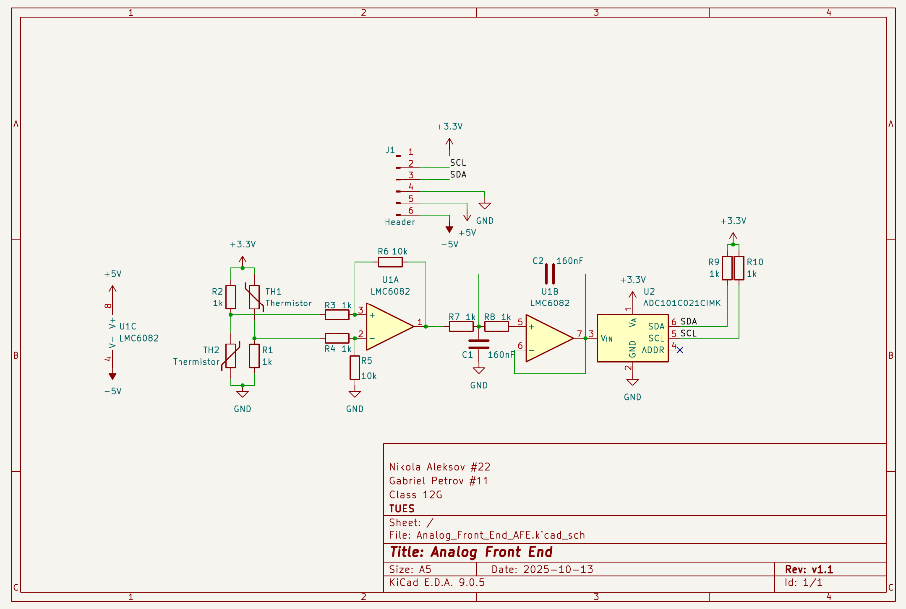
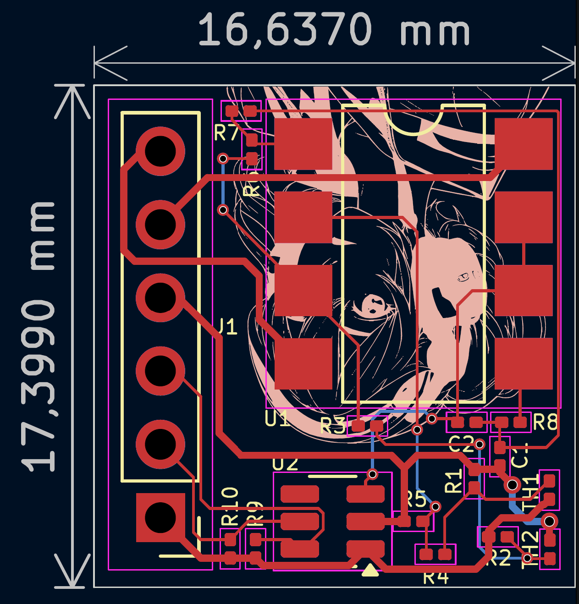

# Analog Front End

A small analog front-end board made as a school PCB exercise.

The circuit takes inputs from two thermistors, conditions the signals using a dual op-amp stage and sends the resulting measurement to an ADC with an I²C interface.

The board was designed in KiCad and measures approximately 17 × 17 mm.

## Main parts

- Two thermistors
- LMC6082 dual op-amp
- ADC101C021 ADC
- RC filtering
- I²C interface

The project was mainly an exercise in laying out a small mixed-signal board and working with analog signal-conditioning circuitry.

## Schematic

[View full schematic PDF](./Schematic_Gabriel_P_Nikola_A.pdf)

## PCB

[View full PCB PDF](./PCB_Gabriel_P_Nikola_A.pdf)
