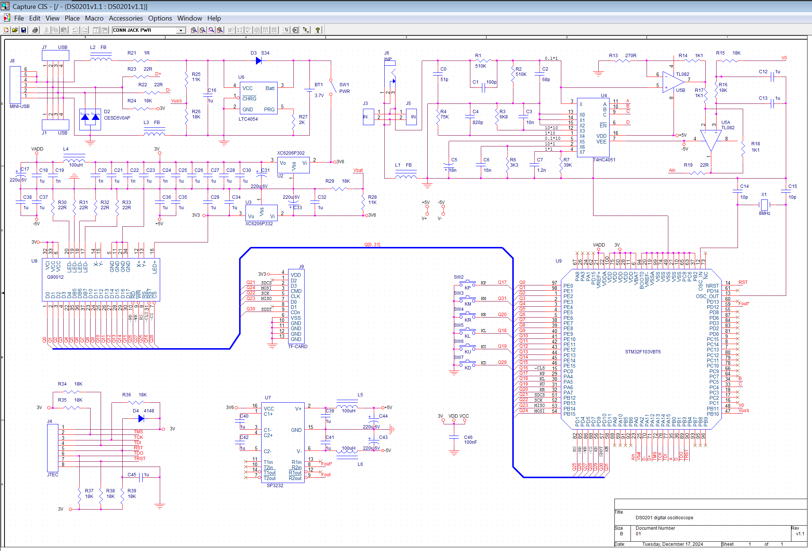
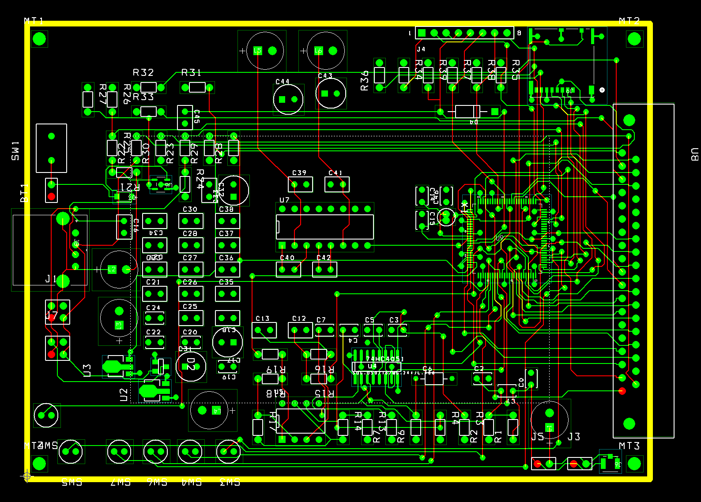
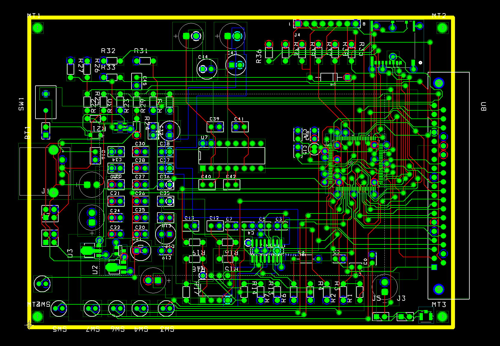
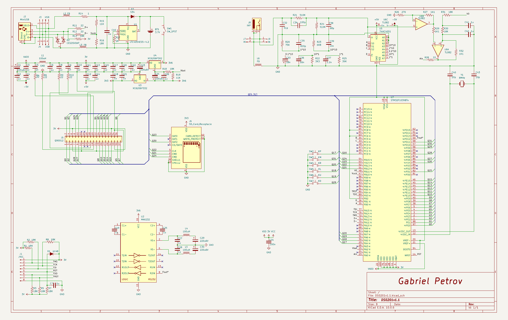
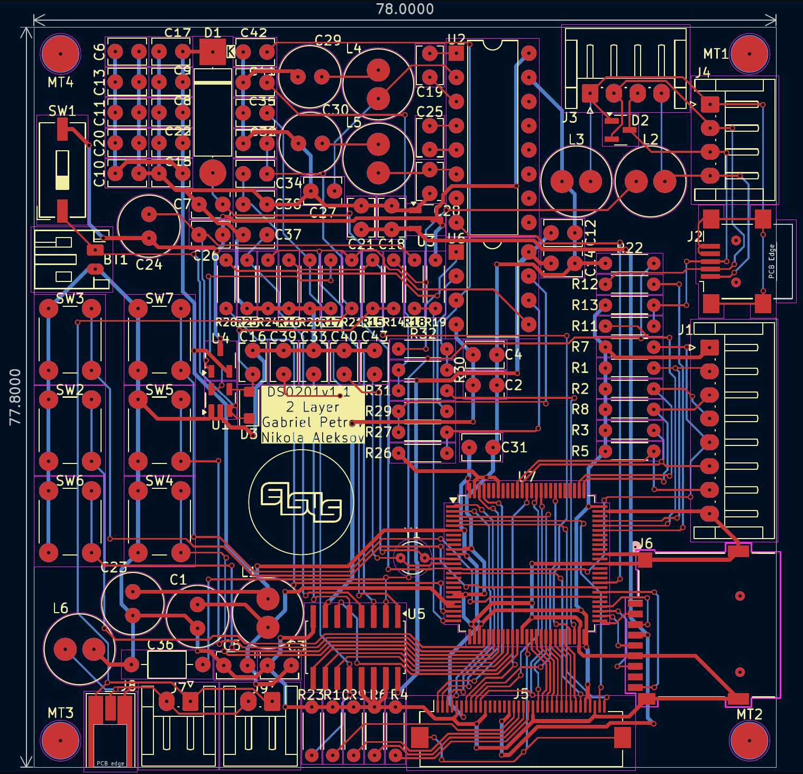
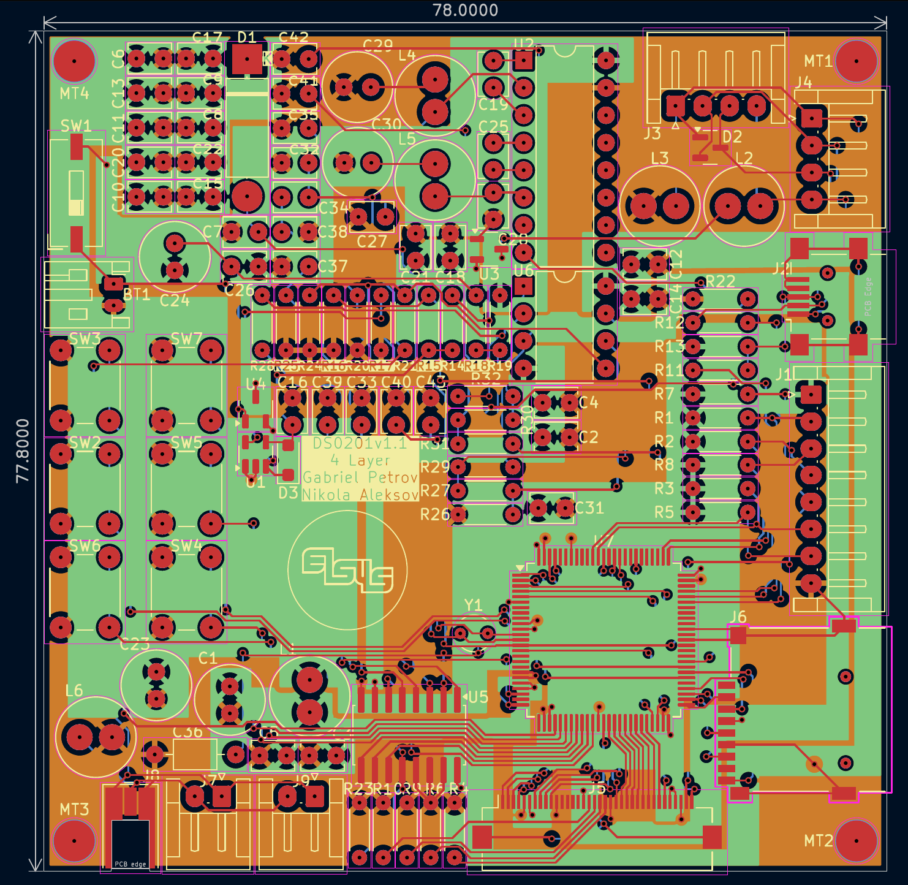

# DS0201

DS0201 was my first PCB design project and the board I originally used to learn the PCB design workflow.

The original versions were made in Cadence OrCAD 10.5. I produced both a 2-layer and a 4-layer layout, working from the same schematic.

The board is based around an STM32F103 and includes several peripheral and analog sections, including SD card storage, USB and battery circuitry, RS-232, switching/multiplexing and analog signal-conditioning circuitry.

## Original OrCAD versions

### Schematic

[View full schematic PDF](./KiCAD/Cadence%20OrCAD%20v10.5/Schematic_CaptureCIS/DS0201_schematic.pdf)

### 2-layer layout

### 4-layer layout

## KiCad versions

After completing the original OrCAD layouts, I recreated the board in KiCad in both 2-layer and 4-layer form.

The KiCad versions were done fairly quickly as an exercise in transferring the same design to a different EDA rather than as a complete layout redesign. Because of that, component placement and layout optimisation were not the main focus of those versions.

The project was useful for comparing the workflow of the two EDA packages and for seeing how the same design changes when moving between two and four copper layers.

### Schematic

[View full schematic PDF](./KiCAD/Schematic.pdf)

### 2-layer layout

[View full 2-layer PCB PDF](./KiCAD/2Layer/2LayerPCB.pdf)

### 4-layer layout

[View full 4-layer PCB PDF](./KiCAD/4Layer/4LayerPCB.pdf)

## Project files

The repository also contains the original OrCAD project files and the KiCad project files for both layouts.
