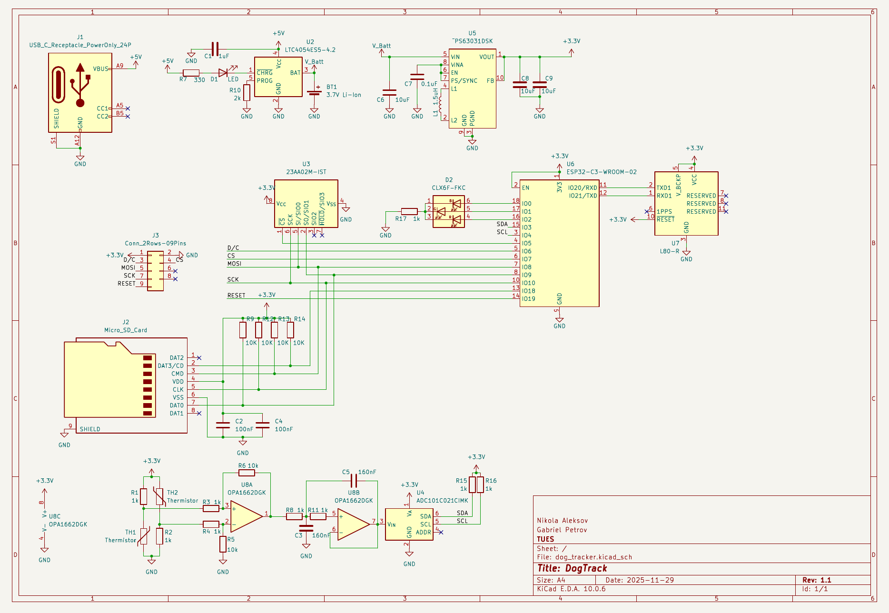
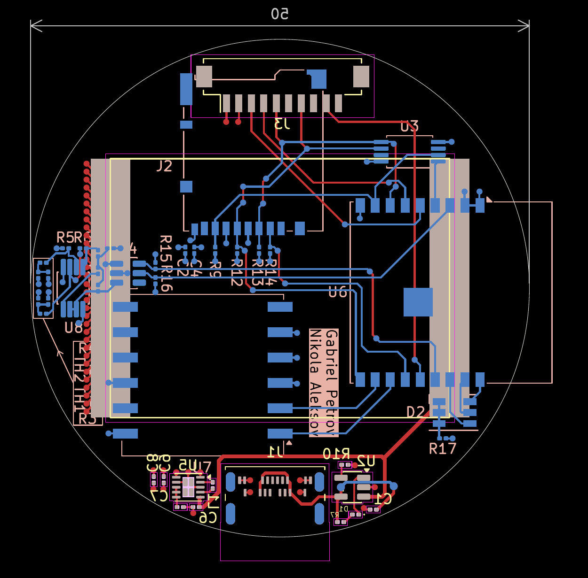

# DogTracker

DogTracker was a school project for a small battery-powered tracking device.

The board is based around an ESP32-C3 and an L80-R GNSS module. It also includes microSD storage, temperature measurement, a serial EEPROM, and the supporting battery charging and power circuitry.

The schematic and PCB were designed in KiCad.

## Main parts

- ESP32-C3-WROOM-02
- L80-R GNSS module
- MicroSD card
- Li-ion battery and USB-C charging
- TPS63031 buck-boost converter
- Thermistor measurement circuitry
- External ADC
- Serial EEPROM

## Design

The board was designed to fit inside a roughly 50 mm circular outline. The project involved fitting the MCU, GNSS module, storage, sensors and power circuitry onto the same board while keeping the different sections reasonably separated.

## Schematic

[View full schematic PDF](./DogTrackSchema.pdf)

## PCB

[View full PCB PDF](./dog_tracker-User_2.pdf)
