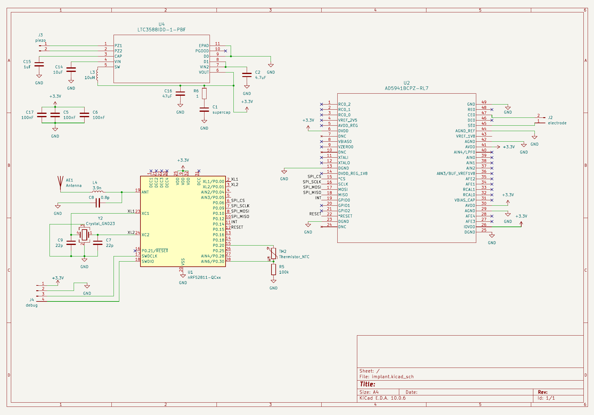
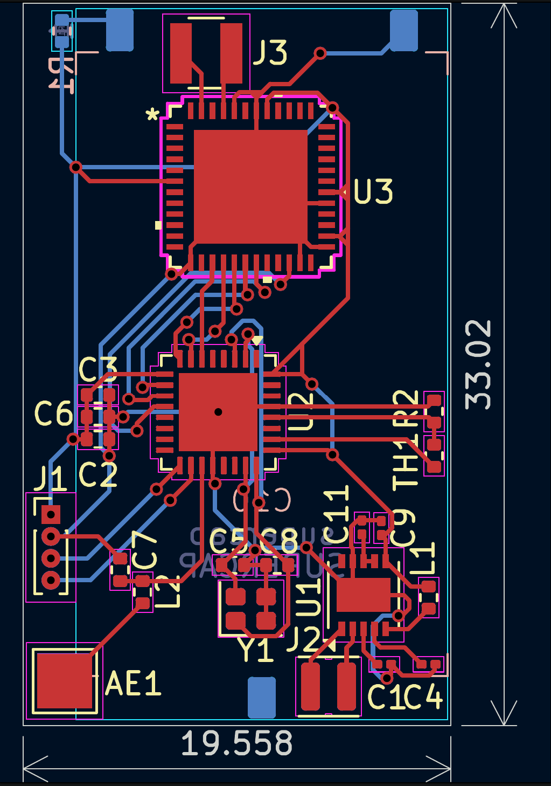

# Implant-Inspired Wireless Sensor

A school PCB project for a compact wireless sensor intended to measure impedance and temperature.

The design is based around an nRF52811 BLE SoC and an AD5941 analog front end for impedance measurement. It also includes temperature sensing and power circuitry based around energy harvesting and supercapacitor storage.

## Main parts

- nRF52811 BLE SoC
- AD5941 impedance-measurement AFE
- LTC3588-1 energy-harvesting IC
- CAP-XX supercapacitor
- NTC temperature sensor
- 2.4 GHz antenna and matching components

The project involved combining digital, analog, RF and power sections on a single PCB and working through the component, footprint and layout requirements of each.

It was an implant-inspired academic design concept.

## Schematic

[View full schematic PDF](./Implant_schema.pdf)

## PCB

[View full PCB PDF](./implant.pdf)
